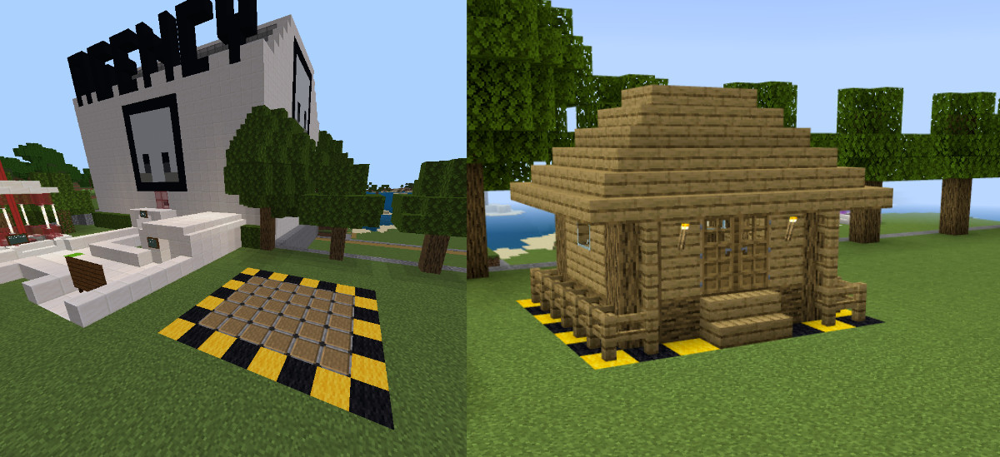

### @explicitHints 1

# Lesson 3: Code a Row of Houses

## Step 1
Manually build the house to your design specification. Do this in the designated construction zone, marked by yellow and black wool.



## Step 2
Rename the **run** element of the ``||Player:on chat command||`` block to **clone_here**. Drag a ``||Blocks:clone from||`` code block to your ``||Player:on chat command||``. 

This code block allows you to clone a designated area of a Minecraft world and place it elsewhere. It's like using copy and paste in other software. You copy an area and then paste it somewhere else in your world.

When you clone, the orientation or direction of the building will be the same as the copied building. So, if the building you copy is facing east, the cloned building will also face east.

#### ~ tutorialhint
``` blocks
player.onChat("clone_here.", function () {
    blocks.clone(
    pos(0, 0, 0),
    pos(0, 0, 0),
    pos(0, 0, 0),
    CloneMask.Replace,
    CloneMode.Normal
    )
})
```

## Step 3
The first two sets of coordinates represent a three-dimensional box with the ``||Blocks:clone from||`` coordinates as one corner and the ``||Blocks:to||`` coordinates as the opposite corner, capturing everything in between like the box in the picture.

The third set of coordinates for the ``||Blocks:into||`` represents the coordinates you want the cloned structure to paste into. 

Let's try it! Find the bottom corner of your model house. In the provided image, we have marked this with Yellow Wool. 

Now create a top and opposite corner, creating an invisible box around the structure. We have done the same with **Yellow Wool** in the image provide. 

## Step 4
Visit the ``||Positions:POSITIONS||`` toolbox drawer and replace the first two coordinates with ``||Positions:world||`` coordinates. We know from our **Yellow Wool** that each of these coordinates are absolute. 

#### ~ tutorialhint
``` blocks
player.onChat("clone_here.", function () {
    blocks.clone(
    world(0, 0, 0),
    world(0, 0, 0),
    pos(0, 0, 0),
    CloneMask.Replace,
    CloneMode.Normal
    )
})
```

## Step 5
Change the first set of coordinates (from **Step 9**) to the ``||Blocks:clone from||`` set in the code block, and the second set of coordinates (from **Step 10**) to the ``||Blocks:to||`` set below them. Remember, the image below has example coordinates. 

The last coordinates are relative to your player, so your player will become the marker for the place you want to clone the house. You'll need to move your player each time you want to clone another house. 

#### ~ tutorialhint
``` blocks
player.onChat("clone_here.", function () {
    blocks.clone(
    world(67, 69, -544),
    world(73, 77, -551),
    pos(0, 0, 0),
    CloneMask.Replace,
    CloneMode.Normal
    )
})
```


## Step 6
Test the code. In Minecraft, move your player to the sky to test your code, paying attention to where the building clones into. 

## Step 7
Build your row of houses. Stand where you would like to place your first house in your final build and type the command **clone_here**. You will note a house appears. 

Once you're done creating the row in the city, you can now remove your model house.  

